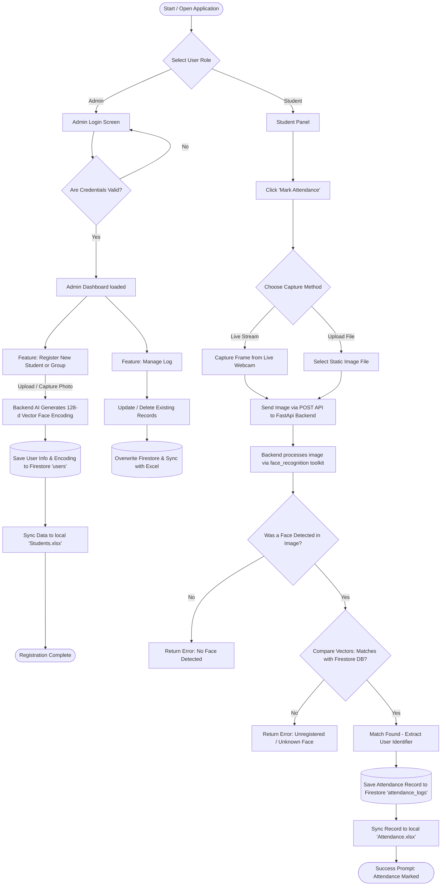

# 🎓 AttendX - Project Documentation (Viva Preparation Guide)

## 1. 💡 Project Overview
AttendX is a smart, biometric attendance management system built using facial recognition technologies. It provides seamless portals for Students (to mark and view their own attendance) and Administrators (to register students and manually manage records). The system stores data safely in the cloud using Firebase Firestore and syncs it with local Excel files to provide easy offline reporting.

**Key Features:**
- **Biometric Authentication:** Face recognition-based attendance marking using webcams or image uploads.
- **Admin Dashboard:** Enables both individual and bulk (group photo) student registrations.
- **Auto Excel Sync:** Automated, real-time Excel sheet generation for attendance logs and registered students.
- **Fluid User Interface:** Client-side Single Page Application (SPA) architecture for a smooth, app-like experience without page reloading.

---

## 2. 🛠️ Technology Stack & Packages

### **Languages & Core Frameworks**
- **Python (3.10):** The primary backend programming language.
- **FastAPI:** A highly performant, modern web framework used to build our backend APIs. Selected for its speed and native asynchronous capabilities.
- **HTML, CSS, JavaScript (Vanilla):** Used for the frontend interface. The CSS uses a modern dark glass-morphism aesthetic, and vanilla JavaScript handles all dynamic UI updates and backend communications.

### **Key Internal Dependencies (from `requirements.txt`)**
- `fastapi` & `uvicorn`: Web framework and ASGI server to process incoming requests and run the backend.
- `opencv-python-headless`: An industry-standard computer vision library used implicitly for processing, capturing, and manipulating image data.
- `face_recognition`: An incredibly powerful wrapper around `dlib` that handles the heavy lifting of facial encoding (converting an image of a face into a unique 128-dimension mathematical vector) and comparing two vectors to identify a match.
- `numpy`: Used for high-speed mathematical operations, specifically manipulating the multi-dimensional arrays representing facial data.
- `pandas` & `openpyxl`: Utilized for smoothly reading, parsing, writing, and structuring the offline Excel file backups (`Attendance.xlsx` and `Students.xlsx`).
- `firebase-admin` & `google-cloud-firestore`: The official SDKs used to authenticate and communicate with the Google Firebase service where we store our NoSQL data.

---

## 3. 📂 Project File Structure and Explanation

- **`server/main.py`**: The heart of the backend. It defines all the API endpoints (e.g., login, register, recognize face, manual entry), manages routing, processes incoming face data, triggers Excel synchronization, and serves the static frontend HTML.
- **`server/firebase_utils.py`**: A dedicated helper file responsible for securely initializing the Firebase app using credentials (`serviceAccountKey.json`) and providing an active connection to the Firestore database.
- **`server/face_utils.py`**: The AI processing module. It defines functions like `get_face_encoding()` and `match_face()` which use the `face_recognition` library to detect faces, generate encodings, and verify identities.
- **`frontend/index.html`**: The single HTML structure containing all the different visual UI views (Role Selection, Admin Panel, Student Panel). Views are hidden or shown dynamically based on the user's current context.
- **`frontend/app.js`**: Contains all frontend logic. It manages camera peripheral access using the browser's MediaDevices API, captures video frames, sends fetch API requests to the Python backend, and interprets the JSON responses.
- **`frontend/style.css`**: The stylesheet implementing responsive mobile-friendly design and our cohesive dark-themed UI.
- **`Attendance.xlsx` & `Students.xlsx`**: Automatically generated spreadsheets ensuring a direct, locally available duplicate of the data present inside our cloud Firestore.
- **`Dockerfile` & `docker-compose.yml` (If present)**: Infrastructure configurations that allow the entire backend and frontend to be easily packaged into a container and deployed seamlessly on servers.

---

## 4. 🔄 System Flowchart

Here is a step-by-step logical flowchart representing how the system works from beginning to end for both scenarios (Admin operations and Student Attendance).

---

## 5. 🧠 Frequently Asked Viva Questions & Answers

**Q: How does the facial recognition actually work in AttendX?**
*A:* It uses the `face_recognition` Python library. First, the algorithm detects a face bounds within an image utilizing a Histogram of Oriented Gradients (HOG) model. Once isolated, the facial landmarks are mapped to create a 128-dimensional numerical vector (an encoding). To recognize a user, the system compares the new encoding vector against all saved encodings in our Firestore database. If the mathematical "distance" (Euclidean distance) between vectors is small enough (below a 0.6 threshold), it confirms the person matches.

**Q: Why did you choose Firebase Firestore over a traditional SQL database?**
*A:* Firestore is a NoSQL, document-based cloud database. It is highly scalable and structurally flexible, meaning it allows us to painlessly insert variable, unstructured data natively—such as an array representing 128 float integers (our face encodings) without needing complex serialized table schema setups like varying SQL architectures would enforce.

**Q: What happens if the database goes down or there is no internet? Is there a backup?**
*A:* The backend workflow handles dual-writing. We designed an automatic Excel synchronization mechanism. Every time a student is registered or attendance is logged in Firestore, the exact same action triggers the Python `pandas` library to append a duplicate entry directly into `Students.xlsx` or `Attendance.xlsx`. This ensures an organized, offline reporting structure is persistently maintained simultaneously.

**Q: How is the app navigating without reloading the browser instance?**
*A:* AttendX behaves as a Single Page Application (SPA). `index.html` holds all of the UI views encapsulated in differing `
` tags. Based on button clicks, `app.js` runs event listeners that simply swap CSS `display` properties (like `display: none` over to `display: flex`), dynamically rewriting the visible page natively without ever fetching a new HTML file from the server.
